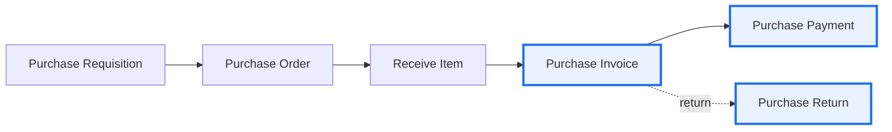
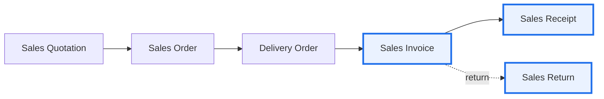
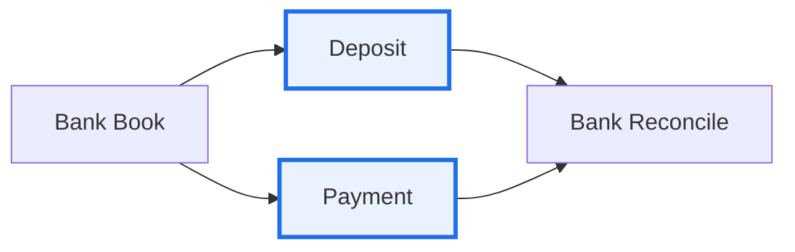
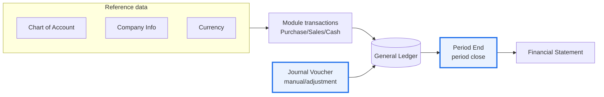

# Module Workflows

In accounting practice, each module has a **standard flow** from the start of a transaction to the
point a journal is formed. Understanding the flow tells you **at which step the journal is created
automatically** and how a module feeds into the General Ledger and then the Financial Statements. The
diagrams below are a **generic re-presentation** of the common flow (not any specific software's UI).

> **How to read:** a **bold-bordered** box = the step where the **journal is formed automatically**.
> Other steps are administrative (no journal yet) or optional.

---

## 1. Purchasing (Procure-to-Pay)

- **Requisition → Order → Receive Item** = administrative stage (no journal yet).
- **Purchase Invoice** = the **main journal** point (`Dr Inventory/Expense | Cr Accounts Payable`).
- **Purchase Payment** = settlement (`Dr Accounts Payable | Cr Cash/Bank`).
- **Purchase Return** = a reversal of the invoice. Details: [Purchase Module](purchase-module-framework.md).

---

## 2. Sales (Order-to-Cash)

- **Quotation → Order → Delivery Order** = administrative stage (no journal yet).
- **Sales Invoice** = the **main journal** point (`Dr Receivable | Cr Revenue + VAT` **and** `Dr COGS |
  Cr Inventory`).
- **Sales Receipt** = collection (`Dr Cash/Bank | Cr Receivable`); this is also where a **tax
  deduction** is recorded when the customer withholds PPh. Details: [Sales Module](sales-module-framework.md).
- **Sales Return** = a reversal of the invoice.

---

## 3. Cash & Bank

- **Deposit / Payment** = cash-bank movements that post a journal, outside the AR/AP cycle — e.g. bank
  charges, capital injections, transfers between cash accounts.
- **Bank Reconcile** = matching the book against the bank statement — not a journal, but a **control**
  so the book balance equals the bank balance.

---

## 4. From the General Ledger to the Financial Statements

- **COA, Company Info, Currency** = reference (setup) data used by all transactions.
- All **module transactions** flow automatically into the **General Ledger**.
- **Journal Voucher** = a **manual** journal for adjustments/corrections not covered by a module
  (amortization, reclass, etc.). Details: [General Ledger — JV](general-ledger-jv-module.md).
- **Period End** = period close; runs closing auto-journals (e.g. depreciation, FX differences).
  Details: [Period-End Closing](period-end-closing-process.md).
- **Financial Statement** = the final output — General Ledger balances pulled into the Balance Sheet,
  Income Statement, etc.

> **The thread:** correct setup → transactions journal automatically at the right point → General
> Ledger → Period End → Financial Statements. The same cycle repeats each period.
