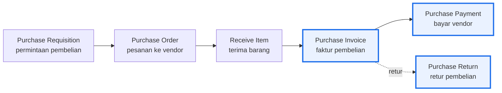
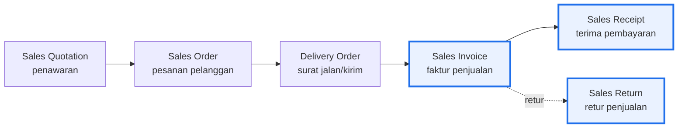
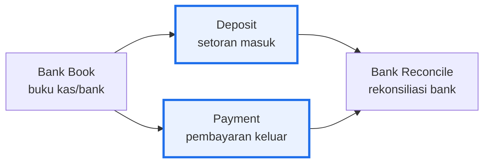
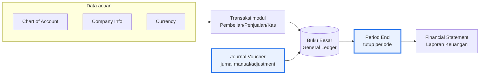

# Alur Kerja Modul (Workflow)

Di praktik akuntansi, tiap modul punya **alur baku** dari awal transaksi sampai jurnal terbentuk.
Memahami alurnya membuat kita tahu **di langkah mana jurnal otomatis dibuat** dan bagaimana satu modul
mengalir ke Buku Besar lalu ke Laporan Keuangan. Diagram di bawah adalah **penyajian ulang generik**
dari alur yang umum dipakai (bukan tampilan software tertentu).

> **Cara baca:** kotak **bergaris tebal** = langkah tempat **jurnal otomatis terbentuk**. Langkah lain
> bersifat administratif (belum menjurnal) atau opsional.

---

## 1. Pembelian (Procure-to-Pay)

- **Requisition → Order → Receive Item** = tahap administratif (belum menjurnal).
- **Purchase Invoice** = titik **jurnal utama** (`Dr Persediaan/Beban | Cr Utang Usaha`).
- **Purchase Payment** = pelunasan (`Dr Utang Usaha | Cr Kas/Bank`).
- **Purchase Return** = kebalikan faktur (reversal). Detail: [Modul Pembelian](modul-purchase-kerangka.md).

---

## 2. Penjualan (Order-to-Cash)

- **Quotation → Order → Delivery Order** = tahap administratif (belum menjurnal).
- **Sales Invoice** = titik **jurnal utama** (`Dr Piutang | Cr Pendapatan + PPN` **dan** `Dr HPP | Cr
  Persediaan`).
- **Sales Receipt** = penerimaan (`Dr Kas/Bank | Cr Piutang`); di sinilah **potongan pajak** dicatat
  bila pelanggan memotong PPh. Detail: [Modul Penjualan](modul-sales-kerangka.md).
- **Sales Return** = kebalikan faktur (reversal).

---

## 3. Kas & Bank

- **Deposit / Payment** = mutasi kas-bank yang menjurnal (masuk/keluar) di luar siklus AR/AP, mis.
  biaya bank, setoran modal, transfer antar-kas.
- **Bank Reconcile** = mencocokkan buku dengan rekening koran bank — bukan menjurnal, tapi **kontrol**
  agar saldo buku = saldo bank.

---

## 4. Buku Besar sampai Laporan Keuangan

- **COA, Company Info, Currency** = data acuan (setup) yang dipakai semua transaksi.
- Semua **transaksi modul** otomatis mengalir ke **Buku Besar**.
- **Journal Voucher** = jurnal **manual** untuk penyesuaian/koreksi yang tak lewat modul (amortisasi,
  reklas, dll). Detail: [Modul General Ledger — JV](modul-general-ledger-jv.md).
- **Period End** = tutup periode; menjalankan auto-jurnal penutup (mis. penyusutan, selisih kurs).
  Detail: [Proses Tutup Periode](proses-tutup-periode-period-end.md).
- **Financial Statement** = hasil akhir — tarikan saldo Buku Besar menjadi Neraca, Laba-Rugi, dll.

> **Benang merahnya:** setup benar → transaksi menjurnal otomatis di titik yang tepat → Buku Besar →
> Period End → Laporan Keuangan. Siklus yang sama berulang tiap periode.
